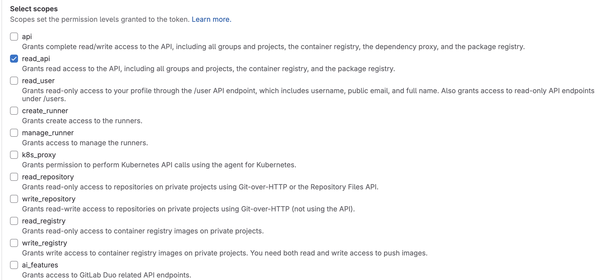

<div align="center">
<picture>
  <source media="(prefers-color-scheme: dark)" srcset=".github/images/logo_dark.png">
  
</picture>
</div>
<p align="center">
Blazingly fast code search 🏎️
</p>
<p align="center">
  <a href="https://demo.sourcebot.dev"></a>
  <a href="mailto:brendan@sourcebot.dev"></a>
  <a href="https://github.com/sourcebot-dev/sourcebot/blob/main/LICENSE"></a>
  <a href="https://github.com/sourcebot-dev/sourcebot/actions/workflows/ghcr-publish.yml"><a>
  <a href="https://github.com/sourcebot-dev/sourcebot/stargazers"></a>
</p>
<p align="center">
<p align="center">
    <a href="https://discord.gg/6Fhp27x7Pb"></a>
</p>
</p>

# About

Sourcebot is a fast code indexing and search tool for your codebases. It is built ontop of the [zoekt](https://github.com/sourcegraph/zoekt) indexer, originally authored by Han-Wen Nienhuys and now [maintained by Sourcegraph](https://sourcegraph.com/blog/sourcegraph-accepting-zoekt-maintainership).


## Features
- 💻 **One-command deployment**: Get started instantly using Docker on your own machine.
- 🔍 **Multi-repo search**: Effortlessly index and search through multiple public and private repositories in GitHub or GitLab.
- ⚡**Lightning fast performance**: Built on top of the powerful [Zoekt](https://github.com/sourcegraph/zoekt) search engine.
- 📂 **Full file visualization**: Instantly view the entire file when selecting any search result.
- 🎨 **Modern web app**: Enjoy a sleek interface with features like syntax highlighting, light/dark mode, and vim-style navigation 

You can try out our public hosted demo [here](https://demo.sourcebot.dev/)!

# Getting Started

Get started with a single docker command:

```
docker run -p 3000:3000 --rm --name sourcebot ghcr.io/sourcebot-dev/sourcebot:main
```

Navigate to `localhost:3000` to start searching the Sourcebot repo. Want to search your own repos? Checkout how to [configure Sourcebot](#configuring-sourcebot).

<details>
<summary>What does this command do?</summary>

- Pull and run the Sourcebot docker image from [ghcr.io/sourcebot-dev/sourcebot:main](https://github.com/sourcebot-dev/sourcebot/pkgs/container/sourcebot). Make sure you have [docker installed](https://docs.docker.com/get-started/get-docker/).
- Read the repos listed in [default config](./default-config.json) and start indexing them.
- Map port 3000 between your machine and the docker image.
- Starts the web server on port 3000.
</details>

## Configuring Sourcebot

Sourcebot supports indexing and searching through public and private repositories hosted on 
<picture>
    <source media="(prefers-color-scheme: dark)" srcset=".github/images/github-favicon-inverted.png">
    
</picture> GitHub and  GitLab. This section will guide you through configuring the repositories that Sourcebot indexes. 

1. Create a new folder on your machine that stores your configs and `.sourcebot` cache, and navigate into it:
    ```sh
    mkdir sourcebot_workspace
    cd sourcebot_workspace
    ```

2. Create a new config following the [configuration schema](./schemas/index.json) to specify which repositories Sourcebot should index. For example, to index [llama.cpp](https://github.com/ggerganov/llama.cpp):

    ```sh
    touch my_config.json
    echo '{
        "$schema": "https://raw.githubusercontent.com/sourcebot-dev/sourcebot/main/schemas/index.json",
        "Configs": [
            {
                "Type": "github",
                "GitHubUser": "ggerganov",
                "Name": "^llama\\.cpp$"
            }
        ]
    }' > my_config.json
    ```

    (For more examples, see [example-config.json](./example-config.json). For additional usage information, see the [configuration schema](./schemas/index.json)).

3. Run Sourcebot and point it to the new config you created with the `-e CONFIG_PATH` flag:

    ```sh
    docker run -p 3000:3000 --rm --name sourcebot -v $(pwd):/data -e CONFIG_PATH=/data/my_config.json ghcr.io/sourcebot-dev/sourcebot:main
    ```

    <details>
    <summary>What does this command do?</summary>

    - Pull and run the Sourcebot docker image from [ghcr.io/sourcebot-dev/sourcebot:main](https://github.com/sourcebot-dev/sourcebot/pkgs/container/sourcebot).
    - Mount the current directory (`-v $(pwd):/data`) to allow Sourcebot to persist the `.sourcebot` cache.
    - Mirrors (clones) llama.cpp at `HEAD` into `.sourcebot/github/ggerganov/llama.cpp`.
    - Indexes llama.cpp into a .zoekt index file in `.sourcebot/index/`.
    - Map port 3000 between your machine and the docker image.
    - Starts the web server on port 3000.
    </details>
    <br>

    You should see a `.sourcebot` folder in your current directory. This folder stores a cache of the repositories zoekt has indexed. The `HEAD` commit of a repository is re-indexed [every hour](https://github.com/sourcebot-dev/zoekt/blob/11b7713f1fb511073c502c41cea413d616f7761f/cmd/zoekt-indexserver/main.go#L86). Indexing private repos? See [Providing an access token](#providing-an-access-token).

    >[!WARNING]
    > Depending on the size of your repo(s), SourceBot could take a couple of minutes to finish indexing. SourceBot doesn't currently support displaying indexing progress in real-time, so please be patient while it finishes. You can track the progress manually by investigating the `.sourcebot` cache in your workspace.

    <details>
    <summary> Using GitLab?</summary>

    _tl;dr: A `GITLAB_TOKEN` is required to index GitLab repositories (both private & public). See [Providing an access token](#providing-an-access-token)._

    Currently, the GitLab indexer is restricted to only indexing repositories that the associated `GITLAB_TOKEN` has access to. For example, if the token has access to `foo`, `bar`, and `baz` repositories, the following config will index all three:

    ```sh
    {
        "$schema": "https://raw.githubusercontent.com/sourcebot-dev/sourcebot/main/schemas/index.json",
        "Configs": [
            {
                "Type": "gitlab"
            }
        ]
    }
    ```

    See [Providing an access token](#providing-an-access-token).
    </details>
    </br>

## Providing an access token
This will depend on the code hosting platform you're using:

<div>
<details>
<summary>
<picture>
    <source media="(prefers-color-scheme: dark)" srcset=".github/images/github-favicon-inverted.png">
    
</picture> GitHub
</summary>

In order to index private repositories, you'll need to generate a GitHub Personal Access Token (PAT) and pass it to Sourcebot. Create a new PAT [here](https://github.com/settings/tokens/new) and make sure you select the `repo` scope:


You'll need to pass this PAT each time you run Sourcebot by setting the `GITHUB_TOKEN` environment variable:

<pre>
docker run -p 3000:3000 --rm --name sourcebot -e <b>GITHUB_TOKEN=[your-github-token]</b> -e CONFIG_PATH=/data/my_config.json -v $(pwd):/data ghcr.io/sourcebot-dev/sourcebot:main
</pre>
</details>

<details>
<summary> GitLab</summary>

>[!NOTE]
> An access token is <b>required</b> to index GitLab repositories (both private & public) since the GitLab indexer needs the token to determine which repositories to index. See [example-config.json](./example-config.json) for example usage.

Generate a GitLab Personal Access Token (PAT) [here](https://gitlab.com/-/user_settings/personal_access_tokens) and make sure you select the `read_api` scope:



You'll need to pass this PAT each time you run Sourcebot by setting the `GITLAB_TOKEN` environment variable:

<pre>
docker run -p 3000:3000 --rm --name sourcebot -e <b>GITLAB_TOKEN=[your-gitlab-token]</b> -e CONFIG_PATH=/data/my_config.json -v $(pwd):/data ghcr.io/sourcebot-dev/sourcebot:main
</pre>

</details>

</div>


## Build from source
>[!NOTE]
> Building from source is only required if you'd like to contribute. The recommended way to use Sourcebot is to use the [pre-built docker image](https://github.com/sourcebot-dev/sourcebot/pkgs/container/sourcebot).

1. Install <a href="https://go.dev/doc/install"> go</a> and <a href="https://nodejs.org/"> NodeJS</a>. Note that a NodeJS version of at least `21.1.0` is required.

2. Install [ctags](https://github.com/universal-ctags/ctags) (required by zoekt-indexserver)
    ```sh
    // macOS:
    brew install universal-ctags

    // Linux:
    snap install universal-ctags
    ```

3. Clone the repository with submodules:
    ```sh
    git clone --recurse-submodules https://github.com/sourcebot-dev/sourcebot.git
    ```

4. Run `make` to build zoekt and install dependencies:
    ```sh
    cd sourcebot
    make
    ```

    The zoekt binaries and web dependencies are placed into `bin` and `node_modules` respectively.

5. Create a `config.json` file at the repository root. See [Configuring Sourcebot](#configuring-sourcebot) for more information.

6. (Optional) Depending on your `config.json`, you may need to pass an access token to Sourcebot:

    <div>
    <details>
    <summary>
    <picture>
        <source media="(prefers-color-scheme: dark)" srcset=".github/images/github-favicon-inverted.png">
        
    </picture>
    GitHub
    </summary>

    First, generate a personal access token (PAT). See [Providing an access token](#providing-an-access-token).

    Next, Create a text file named `.github-token` **in your home directory** and paste the token in it. The file should look like:
    ```sh
    ghp_...
    ```
    zoekt will [read this file](https://github.com/sourcebot-dev/zoekt/blob/6a5753692b46e669f851ab23211e756a3677185d/cmd/zoekt-mirror-github/main.go#L60) to authenticate with GitHub.
    </details>

    <details>
    <summary>
         GitLab
    </summary>
    First, generate a personal access token (PAT). See [Providing an access token](#providing-an-access-token).

    Next, Create a text file named `.gitlab-token` **in your home directory** and paste the token in it. The file should look like:
    ```sh
    glpat-...
    ```
    zoekt will [read this file](https://github.com/sourcebot-dev/zoekt/blob/11b7713f1fb511073c502c41cea413d616f7761f/cmd/zoekt-mirror-gitlab/main.go#L43) to authenticate with GitLab.
    </details>
    </div>

7. Start Sourcebot with the command:
    ```sh
    yarn dev
    ```

    A `.sourcebot` directory will be created and zoekt will begin to index the repositories found given `config.json`.

8. Start searching at `http://localhost:3000`.

## Telemetry

By default, Sourcebot collects anonymized usage data through [PostHog](https://posthog.com/) to help us improve the performance and reliability of our tool. We do not collect or transmit [any information related to your codebase](https://github.com/search?q=repo:sourcebot-dev/sourcebot++captureEvent&type=code). In addition, all events are [sanitized](https://github.com/sourcebot-dev/sourcebot/blob/main/src/app/posthogProvider.tsx) to ensure that no sensitive or identifying details leave your machine. The data we collect includes general usage statistics and metadata such as query performance (e.g., search duration, error rates) to monitor the application's health and functionality. This information helps us better understand how Sourcebot is used and where improvements can be made :)

If you'd like to disable all telemetry, you can do so by setting the environment variable `SOURCEBOT_TELEMETRY_DISABLED` to `1` in the docker run command:

<pre>
docker run -e <b>SOURCEBOT_TELEMETRY_DISABLED=1</b> /* additional args */ ghcr.io/sourcebot-dev/sourcebot:main
</pre>

Or if you are [building locally](#build-from-source), create a `.env.local` file at the repository root with the following contents:
```sh
SOURCEBOT_TELEMETRY_DISABLED=1
NEXT_PUBLIC_SOURCEBOT_TELEMETRY_DISABLED=1
```
