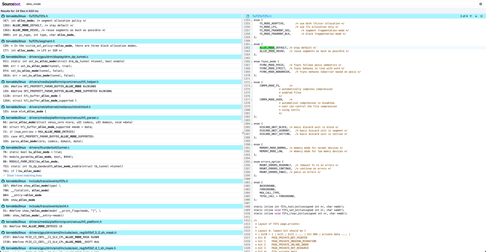

<picture>
  <source media="(prefers-color-scheme: dark)" srcset=".github/images/logo_dark.png">
  
</picture>

[Try the demo!](https://demo.sourcebot.dev)


# About


Sourcebot is a fast code indexing and search tool for your codebases. It is built ontop of the [zoekt](https://github.com/sourcegraph/zoekt) indexer, originally authored by Han-Wen Nienhuys and now [maintained by Sourcegraph](https://sourcegraph.com/blog/sourcegraph-accepting-zoekt-maintainership).

<picture>
  <source media="(prefers-color-scheme: dark)" srcset=".github/images/usage_dark.png">
  
</picture>
<br/>
<br/>

# Getting Started

## Using Docker

0. [Install docker](https://docs.docker.com/get-started/get-docker/)

1. Create a `config.json` file and list the repositories you want to index. For example, if we want to index all repositories in [vercel](https://github.com/vercel), we could use the following config:

```json
{
    "$schema": "https://raw.githubusercontent.com/TaqlaAI/sourcebot/main/schemas/zoekt-mirror.json",
    "Config": [
        {
            "Type": "github",
            "GitHubOrg": "vercel"
        }
    ]
}
```

Sourcebot also supports indexing [GitLab](#gitlab) & [BitBucket](#bitbucket). Checkout the [config schema](./schemas/zoekt-mirror.json) for a full list of available options.

2. Generate a GitHub Personal Access Token (PAT) [here](https://github.com/settings/tokens/new). If you are indexing public repositories only, you can select the `public_repo` scope, otherwise you will need the `repo` scope.  ([GitLab](#gitlab) and [BitBucket](#bitbucket) instructions are below)

3. Launch the latest image from the [GitHub registry](https://github.com/TaqlaAI/sourcebot/pkgs/container/sourcebot):

```sh
docker run -p 3000:3000 --rm --name sourcebot -v $(pwd):/data -e GITHUB_TOKEN=<token> ghcr.io/taqlaai/sourcebot:main
```

Two things should happen: (1) a `.sourcebot` directory will be created containing the mirror repositories and indexes, and (2) you will see output similar to:

```sh
INFO spawned: 'node-server' with pid 10
INFO spawned: 'zoekt-indexserver' with pid 11
INFO spawned: 'zoekt-webserver' with pid 12
run [zoekt-mirror-github -dest /data/.sourcebot/repos -delete -org <org>]
...
INFO success: node-server entered RUNNING state, process has stayed up for > than 1 seconds (startsecs)
INFO success: zoekt-indexserver entered RUNNING state, process has stayed up for > than 1 seconds (startsecs)
INFO success: zoekt-webserver entered RUNNING state, process has stayed up for > than 1 seconds (startsecs)
```

zoekt will now index your repositories (at `HEAD`). By default, it will re-index existing repositories every hour, and discover new repositories every 24 hours.

4. Go to `http://localhost:3000` - once a index has been created, you should get results.


## Building Sourcebot

TODO

## GitLab

TODO

## BitBucket

TODO

### Todos
- Add instructions on using GitLab and BitBucket
- Add instructions on building Sourcebot locally
