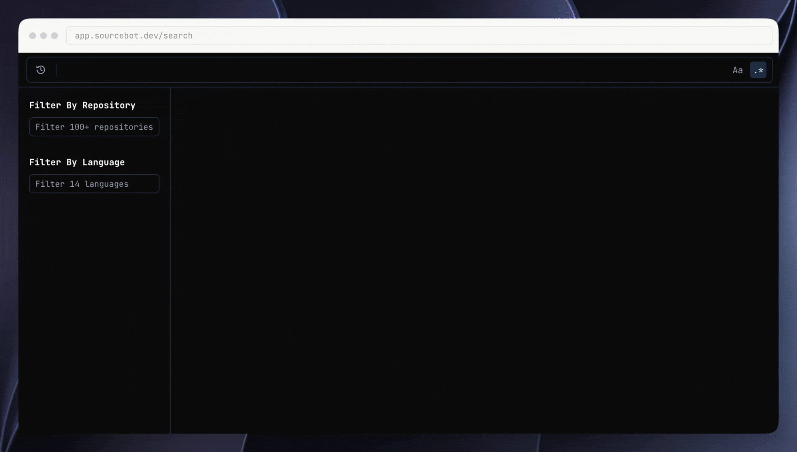
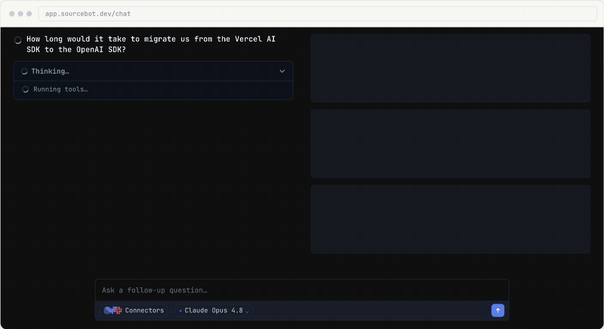

<p align="center">
  <picture>
    <source media="(prefers-color-scheme: dark)" srcset=".github/images/logo_dark.png">
    
  </picture>
</p>

<h3 align="center">Code understanding for humans and agents</h3>

<p align="center">
  <a href="https://www.sourcebot.dev">Website</a> ·
  <a href="https://docs.sourcebot.dev">Docs</a> ·
  <a href="https://app.sourcebot.dev">Public demo</a> ·
  <a href="https://www.sourcebot.dev/changelog">Changelog</a>
</p>

Sourcebot is a self-hosted code context layer for humans and AI agents. Index all your repos in one place so you and your agents can search and navigate them.

## Get started

Run the setup wizard:

```sh
npx setup-sourcebot
```

You'll need Node.js (24 LTS recommended), Docker, and Docker Compose.

This wizard walks you through indexing your repos, optionally configuring a language model provider (for [Ask Sourcebot](https://docs.sourcebot.dev/docs/features/ask/ask-sourcebot)), and then creates the config files for you and starts up Sourcebot.

For manual setup, use [Docker Compose](https://docs.sourcebot.dev/docs/deployment/docker-compose) or the [Helm chart](https://github.com/sourcebot-dev/sourcebot-helm-chart). Check out our [docs](https://docs.sourcebot.dev/) for more info on how to configure Sourcebot. 

## Code Context for Agents

Your agent can use [Sourcebot MCP](https://docs.sourcebot.dev/docs/features/mcp-server) to search repos you haven't checked out locally. For example, it can find callers of an API in other services or read the implementation for dependencies that you don't have checked out locally.


The MCP server exposes code search, file reading, and symbol definitions and references for the repos you've indexed. Open **Settings → MCP** in Sourcebot to connect Claude Code, Codex, Cursor, or another MCP client. The [MCP docs](https://docs.sourcebot.dev/docs/features/mcp-server) cover setup and authentication for each client.

Connect repos from GitHub, GitLab, Bitbucket, Azure DevOps, or local Git directories using the [connection guides](https://docs.sourcebot.dev/docs/connections/indexing-your-code). [Permission syncing](https://docs.sourcebot.dev/docs/features/permission-syncing) controls access based on your code host's repository permissions.

## Code Search

[Code Search](https://docs.sourcebot.dev/docs/features/search/code-search) lets you search across all your indexed repos and branches in one place. Find uses of a dependency, track down a function, or look for a pattern across services without cloning each repo.

Use regular expressions and boolean queries, then narrow the results by repo, file, language, or symbol definition. Results include syntax-highlighted code, with repo and language filters alongside them.

Try it: [example search](https://app.sourcebot.dev/search?query=render%20lang%3Atypescript) in the public demo.

[](https://app.sourcebot.dev/search?query=render%20lang%3Atypescript)

## Ask Sourcebot

[Ask Sourcebot](https://docs.sourcebot.dev/docs/features/ask/ask-sourcebot) answers questions about your codebase, including repos you haven't checked out locally. Ask how a feature works or what a migration would involve. [Connectors](https://docs.sourcebot.dev/docs/features/ask/connectors) let Ask access your apps and services with your permissions, so it can pull in context and take actions like creating a Linear or Jira issue with its findings. It searches your code and follows references using the same tools as the MCP server.

Open cited code alongside the answer, explore generated diagrams, and share the conversation with your team. Ask runs on a [language model provider you configure](https://docs.sourcebot.dev/docs/configuration/language-model-providers) (Bring Your Own Key), so you control where your code is sent.

Try it: [explore an example Ask Sourcebot conversation](https://app.sourcebot.dev/chat/cmt1kzlyv0062oq5axens5rdl) in the public demo.

[](https://app.sourcebot.dev/chat/cmt1kzlyv0062oq5axens5rdl)

Try both in the [public demo](https://app.sourcebot.dev). See [pricing](https://www.sourcebot.dev/pricing) for plan details.


## Feedback

[Report a bug or request a feature](https://github.com/sourcebot-dev/sourcebot/issues/new/choose).
