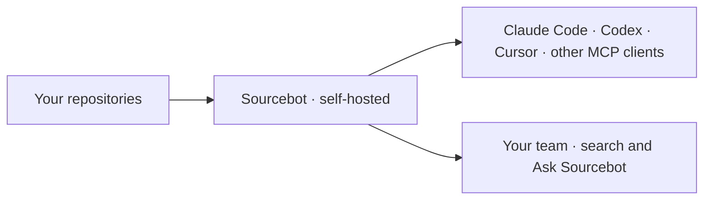

<p align="center">
  <picture>
    <source media="(prefers-color-scheme: dark)" srcset=".github/images/logo_dark.png">
    
  </picture>
</p>

<h3 align="center">Code understanding for humans and agents</h3>

<p align="center">
  <a href="https://www.sourcebot.dev">Website</a> ·
  <a href="https://docs.sourcebot.dev">Docs</a> ·
  <a href="https://app.sourcebot.dev">Public demo</a> ·
  <a href="https://www.sourcebot.dev/changelog">Changelog</a>
</p>

Sourcebot is a self-hosted code context layer for your team and AI coding agents. Index your repositories in one place, then let Claude Code, Codex, Cursor, and other MCP clients search and explore them—even when you haven't checked them out locally.

Use the same index yourself to search across repositories and branches, navigate code, and ask questions with answers grounded in your codebase.

## Get started

Run the setup wizard:

```sh
npx setup-sourcebot
```

You'll need **Node.js (24 LTS recommended), Docker, and Docker Compose**. The wizard helps you select repositories, optionally configure an AI provider, and launch Sourcebot. Once it's ready, open [localhost:3000](http://localhost:3000) to finish onboarding.

Prefer to configure the deployment yourself? Use [Docker Compose](#docker-compose) or the [Helm chart](#kubernetes).

## Give your agents context beyond local checkouts

Your coding agent can read repositories you have checked out locally. Sourcebot extends that context to repositories you've indexed, without requiring a local checkout of each one. That includes shared libraries, upstream services, API consumers, and implementation examples across your codebase.


```mermaid
flowchart LR
    Repos[Your repositories] --> Sourcebot[Sourcebot · self-hosted]
    Sourcebot --> Agents[Claude Code · Codex · Cursor · other MCP clients]
    Sourcebot --> Team[Your team · search and Ask Sourcebot]
```

Through Sourcebot's MCP server, agents can search code, read files, and look up symbol definitions and references. Connect repositories from GitHub, GitLab, Bitbucket, Azure DevOps, or local Git directories.

After deployment, open **Settings → MCP** in Sourcebot to connect your agent. See the [MCP setup guide](https://docs.sourcebot.dev/docs/features/mcp-server) for client-specific instructions and authentication options, or [explore the code context walkthrough](https://www.sourcebot.dev/code-context).

## Explore the code yourself

- **[Code search](https://docs.sourcebot.dev/docs/features/search/code-search):** Search across repositories and branches with regular expressions, language and repository filters, and boolean queries.
- **[Ask Sourcebot](https://docs.sourcebot.dev/docs/features/ask/ask-sourcebot):** Ask questions about your codebase and get answers with inline citations. Bring your own [language model provider](https://docs.sourcebot.dev/docs/configuration/language-model-providers).
- **[Repository connections](https://docs.sourcebot.dev/docs/connections/indexing-your-code):** Keep your index in sync across code hosts. Configure [permission syncing](https://docs.sourcebot.dev/docs/features/permission-syncing) to respect repository access.

Try search and Ask in the [public demo](https://app.sourcebot.dev). See [plans and feature availability](https://www.sourcebot.dev/pricing) for your deployment.

## Deploy it your way

### Docker Compose

The published image is `docker.sourcebot.dev/sourcebot-dev/sourcebot:latest`. The maintained Compose file runs it alongside the required PostgreSQL and Redis services.

1. In a new directory, download the Compose file:

   ```sh
   curl -fsSL -o docker-compose.yml https://raw.githubusercontent.com/sourcebot-dev/sourcebot/main/docker-compose.yml
   ```

2. Create `config.json` in the same directory. This example indexes Sourcebot's public repository:

   ```json
   {
     "$schema": "https://raw.githubusercontent.com/sourcebot-dev/sourcebot/main/schemas/v3/index.json",
     "connections": {
       "github": {
         "type": "github",
         "repos": ["sourcebot-dev/sourcebot"]
       }
     }
   }
   ```

   See the [configuration reference](https://docs.sourcebot.dev/docs/configuration/config-file) to index your own repositories, add credentials, and configure AI providers.

3. Replace the default secrets and credentials marked `CHANGEME` in `docker-compose.yml` before starting. Keep the PostgreSQL password and `DATABASE_URL` in sync. See the [Docker Compose guide](https://docs.sourcebot.dev/docs/deployment/docker-compose) and [environment variable reference](https://docs.sourcebot.dev/docs/configuration/environment-variables).

4. Start Sourcebot:

   ```sh
   docker compose up -d
   ```

   Open [localhost:3000](http://localhost:3000) once the app is ready to finish onboarding.

### Kubernetes

Use the [Sourcebot Helm chart](https://github.com/sourcebot-dev/sourcebot-helm-chart) for Kubernetes deployments. The chart README covers installation and configuration; the [sizing guide](https://docs.sourcebot.dev/docs/deployment/sizing-guide) covers resource planning.

## Contribute and get help

- Read [CONTRIBUTING.md](CONTRIBUTING.md) to build from source or contribute a change.
- [Report a bug or request a feature](https://github.com/sourcebot-dev/sourcebot/issues/new/choose).
- Reach us at [team@sourcebot.dev](mailto:team@sourcebot.dev).

Sourcebot collects usage telemetry by default. See the [telemetry documentation](https://docs.sourcebot.dev/docs/misc/telemetry) for details and configuration options.

Sourcebot is source-available under the [Functional Source License](LICENSE.md), with separate terms for enterprise code and third-party components.
